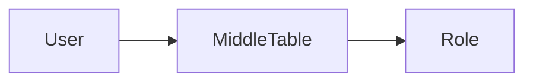
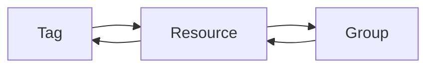

## Introduction of RBAC

Normally, we have a powerful structure for designing a authorization system, which named RBAC (Role based access control)[^1]. It's a regular model, while the idea of this model is based on dividing the authorization and user table, to become a structure like the following.

The model divides the role and user, that is meaningful in the convenient for managing the relations between users and roles, which allows one user hold multiple roles and easily in changing the role of user.

But in this way, the structure will take numbers of the middle table inside of Users and Role, always increased to about 15 tables. And it will take challenges for the performance and engineers have to design a multiple-layer cache to improve the performance into a usable system, since in almost each request need an authority.

## Introduction of RGT

And there are another model named RGT (resource-group-tags), it is wildly used in Microsoft Azure to serve millions of online service[^2]. Engineers propose the RGT model in the following structure,

Both of the relations in tags and resources, and groups and resources, are many to many. The resources is abstracted from operation authority and data authority, which dividely stand by the visible domains and feasible domains.

And this design could save a lot of tables to nearly 3-4. This is a obviously decreasing then RBAC model. Also reducing the requirement of cache. Significantly, the reducing in database tables can reach less complexity in implementations and maintains. However, the RGT is not the perfect. The increasing of design hardness has replaced the decrease in code and tables. It reqire the structure engineer have a good mind in abstract design.

[标记资源、资源组和订阅以便对其进行逻辑组织 - Azure Resource Manager | Microsoft Learn](https://learn.microsoft.com/zh-cn/azure/azure-resource-manager/management/tag-resources?tabs=json)

And next we will take a example in details to illustrate how RGT works in the a authorization system.

// TODO

4、实施的具体步骤
经过前面的对比，自行选择适合的方案，后续章节仅针对RGT展开。

4.1、定义资源、组、Tag
确认模型后的第一步需要根据实际项目情况定义资源、组、Tag分别代表什么。以图1为案例（后续也使用该业务为案例），在其基础上拓展一层公司，公司与公司间的权限完全隔离，公司内部的权限采用层级管理；那么资源代表用户和权限，组代表组织、身份、用户组、角色，Tag代表公司。

4.2、套入模型
模型只是定义了权限相关的设计，并没有包含业务，需要把模型套入实际的项目中并且根据实际业务情况拓展用户、公司等基础信息的字段，并且在需要做数据权限的相关业务表上添加Tag字段（复杂数据权限可以使用多对多）。

4.3、基础数据初始化
要让权限系统正常工作，需要预先把基础的用户、权限、组织、身份、用户组、角色、公司等信息添加到系统中。

4.4、鉴权
当某个用户请求某个资源时，首先判定该用户是否具有访问该资源的功能权限（查询资源-组映射表），然后判定该用户是否具有访问该资源的数据权限（查询Tag）。

4.5、优化
至此，核心业务功能已经完成了，对性能没要求的业务就结束了。

由于鉴权是无处不在的，如果每一个动作都按如上操作进行鉴权，那性能是无法忍受的（一次鉴权至少需要3次查询，平均开销50ms+），那就开始优化吧。第一步：直接缓存4个表的数据，平均开销能压到5ms左右。第二步：重构4个表的数据，采用K-V结构缓存，平均开销能压到2ms左右。第三步：集中缓存+本地缓存，平均开销能压到0.1ms左右。

> https://blog.csdn.net/tablelai/article/details/105296236

[^1]: Bisma M, Azam F, Rasheed Y, et al. A Model-Driven Framework for Ensuring Role Based Access Control in IoT Devices[C]//Proceedings of the 2020 6th International Conference on Computing and Artificial Intelligence. 2020: 455-460.
    
[^2]: Copeland M. Cyber Security on Azure[M]. Apress:, 2017.
